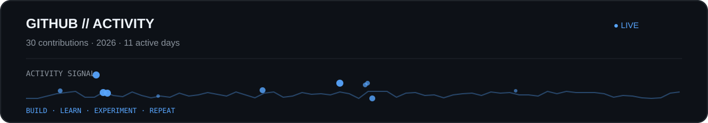

  

&nbsp;&nbsp;&nbsp;

&nbsp;&nbsp;&nbsp;

&nbsp;&nbsp;&nbsp;

  

# Hey, I'm Manjul 👋

### AI/ML Enthusiast · Developer · Embedded Systems Explorer

---

## 👨‍💻 About Me

- 🤖 Exploring **Artificial Intelligence & Machine Learning**
- 💻 Building with **Python, JavaScript, React & Node.js**
- 🧠 Practising **Data Structures & Algorithms**
- ⚡ Experimenting with **Arduino, ESP32 & Raspberry Pi**
- 🔧 I like understanding how things work rather than just using them
- 🚀 Always building something that teaches me something new

> `learn → build → break → fix → repeat`

---

## ⚙️ Tech Stack

### 💻 Languages

### 🤖 AI / ML & Development

### 🗄️ Databases

### 🧰 Tools & Platforms

### ⚡ Embedded Systems

 
Arduino · ESP32 · Raspberry Pi

---

## 📡 GitHub Activity

  

---

## 🌌 Contribution Galaxy

---

`build • learn • experiment • repeat` ✨

